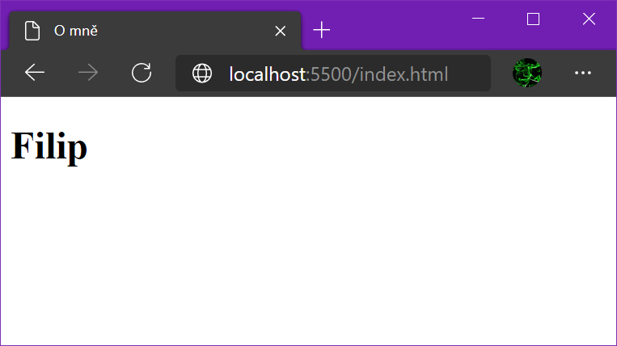
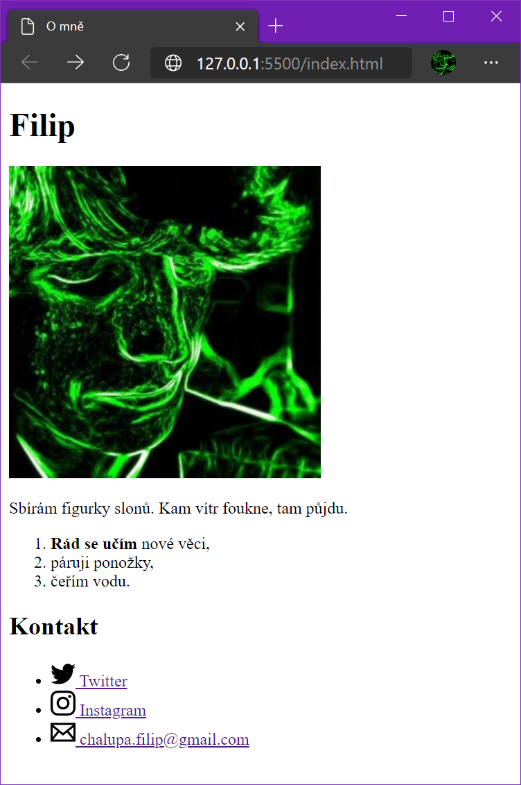
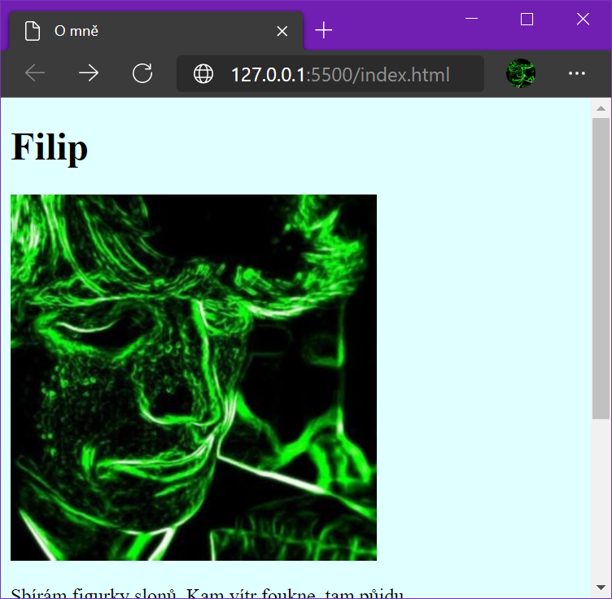
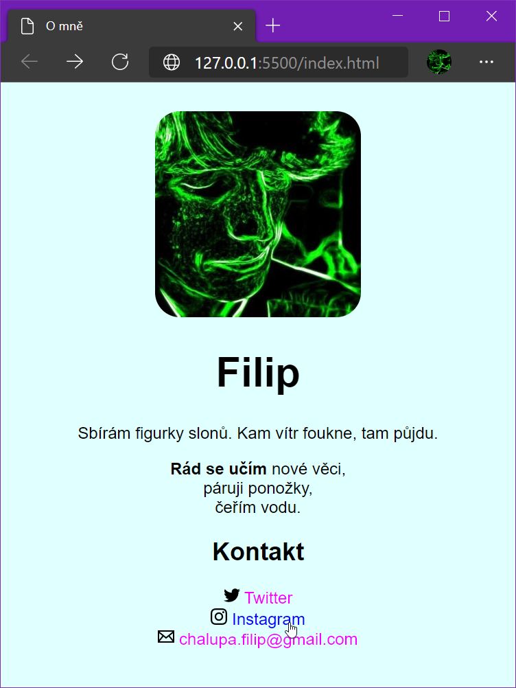

# Cvičení: Vizitka

V tomto cvičení si osvěžíš základy HTML a CSS.

## Zadání

1. Vytvoř u sebe na počítači složku. Pojmenuj ji třeba `Vizitka`.

1. Přidej do ní `index.html`.

1. V html nachystej základní strukturu `<!DOCTYPE html><html>…</html>`.

1. Do těla stránky, mezi tagy `<body>` a `</body>`, přidej hlavní nadpis úrovně 1 s tvým jménem nebo pseudonymem.

1. Otevři stránku pomocí [Live Serveru](https://marketplace.visualstudio.com/items?itemName=ritwickdey.LiveServer) v prohlížeči. Stránka by měla vypadat přibližně takhle:

   

1. Do html přidej další obsah.

   1. Tvou profilovou fotku nebo libovolnou oblíbenou pomocí tagu ``.

   1. Krátký odstavec s textem o tobě.

   1. Číslovaný seznam s tvými oblíbenými činnostmi.

   1. Nejoblíbenější činnost označ tagem `<strong>`.

   1. Odrážkový seznam s odkazy, kde jsi online k zastižení.

      - Aspoň jeden odkaz nasměruj na externí web a jeden do e-mailového klienta pomocí `mailto`.

   1. Doplň k odkazům ikonky. Ikonky k volnému užití najdeš například na webu [iconmonstr.com](https://iconmonstr.com/).

   

1. Nastav celé stránce jinou barvu pozadí.

   1. Vytvoř soubor pro styly s příponou `.css`.

   1. Do souboru přidej kód s libovolnou oblíbenou barvou:

      ```css
      body {
      	background-color: lightcyan;
      }
      ```

   1. Nalinkuj stylový soubor v hlavičce html.

      ```html
      <link rel="stylesheet" href="nazev_souboru.css" />
      ```

   

1. Dostyluj stránku podle svého uvážení.

   - Nastav bezpatkový font.

   - Vystřeď text na stránce.

   - Skryj seznamům odrážky, číslování. Spoj selektory v jeden pomocí čárky.

     ```css
     ul,
     ol {
     	list-style-type: none;
     }
     ```

   - Oprav seznamům odsazení.

   - Zmenši ikonky podle velikosti textu.

     ```
     width: 1em;
     height: 1em;
     ```

   - Zaobli okraje profilové fotce. Přidej jí css třídu, ať styly novlivňuješ i ikonky u odkazů.

   - Obravi odkazy a zruš jim výchozí podtržení.

   - Po najetí myši je zvýrazni jinou barvou.

   [](https://vizitka.netlify.app/)

1. Hotový web, složku nahraj na internet pomocí [Netlify Drop](https://app.netlify.com/drop), aby si ji mohli prohlédnout i ostatní.

   - Netlify web po čase smaže. Pokud o něj nechceš přijít, vytvoř si účet. Je to zdarma.
